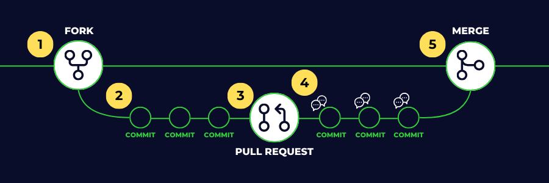

# Contribute to the Code Network Website

We welcome and appreciate any contributions to our club's website, whether you are a current student or not. Please have a read over these guidelines before making any contributions to the project.

Our aim, as a club, is to make this project as accessible to the community as possible. We hope that this guide will help you to get started in working on our website and building awesome things yourself!

## New Here?

Welcome to the repository for our website! There are many ways you can contribute which we hope to outline in this document.

We  encourage you to join the [Code Network Discord Server](https://discord.gg/scXBk2j4uE) and to select the projects that you would be interested in contributing to so that you can see the relevant channels for these projects.

Additionally, we recommend you visit the Open Source Guide's ["How to Contribute" guide](https://opensource.guide/how-to-contribute/) for more ideas and information about how you can contribute to an open-source project such as this one.

## Code of Conduct

By contributing to this project, you agree to abide by the [Code Network Code of Conduct](./CODE_OF_CONDUCT.md). This Code of Conduct applies the same to online projects as it does our in-person events, and is designed to ensure that all people involved with our club are able to have a positive experience with our programs.

## Reporting Bugs or Feature Ideas

See something not quite working right on our website? Have an idea for something we should add or change about our website?

Visit the [issues](https://github.com/codenetwork/codenetwork.co/issues) page and, first, check if an issue has already been created with that bug or feature idea.

If not, create an issue, selecting the relevant template. Please include as much detail as possible about the bug or feature request. Please note that our community may follow-up with you about your issue to request further details.

Once you have created an issue, please assign all necessary labels so we are able to keep our list of issues nice and organised.

## Writing Code

The easiest way to contribute to this project is to write code. You could either add your own feature, or take a look at the list of [issues](https://github.com/codenetwork/codenetwork.co/issues) and find one to work on.

The steps below outline the process to add your own code to the project:

1. [Create a fork of this repository](https://github.com/codenetwork/codenetwork.co/fork)
2. Clone the fork to your computer, write some code, and commit as you go.
3. When your changes are ready to be merged with the main codebase, [create a pull request](https://docs.github.com/en/pull-requests/collaborating-with-pull-requests/proposing-changes-to-your-work-with-pull-requests/creating-a-pull-request).
4. Our team will review your pull request and will discuss with you if any changes need to be made. You are still able to make further commits at this point.
5. Once our team is satisfied, we will approve your pull request and merge your fork with our repository.

The flowchart below visually summarises this process:

### Finding things to work on

Our [issues page](https://github.com/codenetwork/codenetwork.co/issues) is the easiest place to find ideas for things to contribute to the project. Here, you will find feature requests and bug reports that will need to be addressed.

[Issues that don't have an assignee](https://github.com/codenetwork/codenetwork.co/issues?q=is%3Aissue%20state%3Aopen%20no%3Aassignee) are available for you to work on. If you see an issue that you would like to work on, leave a comment, and a member of our team will allocate you to the issue.

Here are some tips to help you find something to work on:

- Filter by labels:
    -  issues are those that we believe are best targeted towards beginners and first-time contributors on the project.
    -  issues are those that we may need some additional help from our community.
- If you find an issue you would like to work on, add a comment to ask questions and to find out further details.
- Don't feel like there is anything for you to contribute to? Send a message in the Discord channel and our team will try and find something work you to work on!

## Documentation

Thanks to the simplicity of the project, there isn't a lot of documentation that needs to be maintained. However, if you see any areas where our wording can be clarified, by all means open an issue, or make any changes.

The process for writing documentation is similar to contributing code, so we would recommend referring to the above process.

## Any Questions?

If you have any questions about these guidelines, we recommend that you reach out through our Discord server, linked above. Alternatively, send us an email via hello@codenetwork.co and we will be more than happy to assist!
