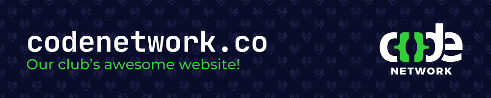

<h1>Code Network's Website</h1>

This repository contains the source code for Code Network's new website. This website is used to communicate Code Network's purpose and activities to students, staff, and members of the industry who are interested in learning more about our club.

We are open sourcing the website as we would love for students who share an interest in Code Network and our mission to contribute their design and development expertise to making an awesome website for our club.

> [!NOTE]
> This repository is for the 2025 rebuild of the website. To see the previous version of our website, visit https://github.com/codenetwork/viteCN.

## 📌 Features

- Home page showcasing our club at a glance
- About us page where the public can find more information about who we are.
- Events page listing the various events we have coming up
- Projects page showing the cool projects our club is building
- And more!

## 🚀 Installation

1. Ensure you have Node.js installed (v22 recommended).
2. Run `npm install`
3. (optional) Install the recommended VS Code dependencies (Astro, TailwindCSS, and Prettier)

### 🖥️ Usage

Run `npm run dev` in the project directory and then navigate to `http://localhost:4321`.

## 🛠️ Technologies Used

- **[Astro](https://astro.build/)** (Static Website Generator)
- **[TailwindCSS](https://tailwindcss.com/)** (Web Styling Library)

## 🌟 If You Are Interested

We welcome contributions from all members of the Code Network and broader community. For more information, please take a look at the [Contributing Guidelines](./CONTRIBUTING.md).

Below are some of the ways you can contribute to this project:

- **Web Development:** If you're looking to develop parts of our website, take a look at our issues page, and find a feature that needs implementing that you feel meets your skillset.
- **Testing:** If you enjoy breaking things apart and making sure they look and function as expected, test out the website and report bugs for anything that doesn't quite seem right.
- **Brainstorming Ideas:** If you like coming up with new ways of doing things, create an issue for any features you think we should add to our website.
- **Documentation:** Improving explanations in the README, adding guides to help beginners get started, or fixing typos can be a huge help.

Please note that our [Code of Conduct](./CODE_OF_CONDUCT.md) applies to all contributors.
